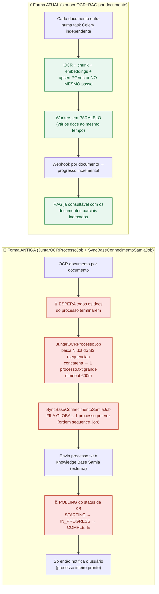
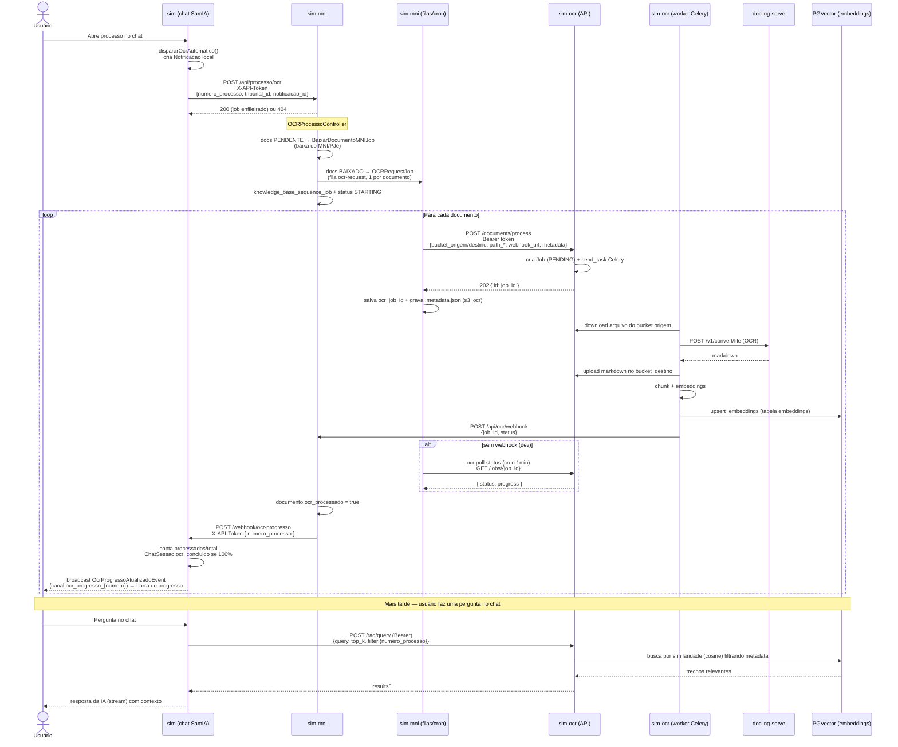
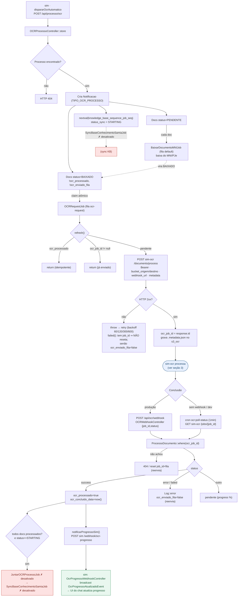
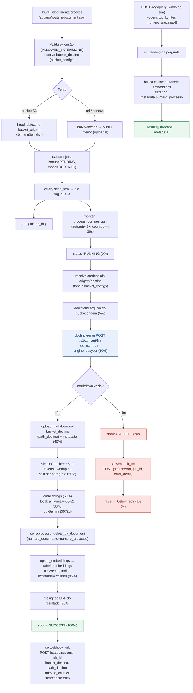

# Fluxo OCR + RAG entre SIM, SIM-MNI e SIM-OCR

Fluxo ponta a ponta envolvendo os três serviços:

| Serviço | Stack | Papel |
|---------|-------|-------|
| **sim** | Laravel / Filament / Livewire | UI do chat SamIA. Dispara o OCR, recebe progresso em tempo real e consulta o RAG. |
| **sim-mni** | Laravel (microserviço) | Orquestra o OCR: integra com MNI/PJe, baixa documentos e fala com o sim-ocr por documento. |
| **sim-ocr** | FastAPI + Celery + docling-serve + PGVector | Faz o OCR de cada arquivo, indexa no banco vetorial e responde consultas RAG. |

Blocos marcados `✗ desativado` estão comentados no código do sim-mni
("desativado temporariamente — sem Samia").

---

## 0. Antes × Depois (por que ficou mais rápido)

**Onde o tempo era perdido na forma antiga:**

| Gargalo | Antiga | Atual |
|---------|--------|-------|
| Disponibilidade | Nada utilizável até o **último** documento do processo terminar | Cada documento fica pesquisável **assim que termina** |
| Junção | `JuntarOCRProcessoJob` lê N arquivos do S3 em série e monta um `processo.txt` único (timeout 600s) | **Não existe** — indexação direta por documento |
| Sincronização | `SyncBaseConhecimentoSamiaJob`: fila **global, 1 processo por vez** (por `sequence_job`) | Tasks Celery **paralelas**, sem fila global |
| Detecção de fim | **Polling** periódico do status da KB (`STARTING→IN_PROGRESS→COMPLETE`) | **Event-driven**: webhook por documento |
| Dependência externa | Ingestão/embedding na Knowledge Base Samia (Bedrock) — tempo próprio | Embedding local/Gemini dentro da própria task |

Resumo: a forma antiga era **sequencial e em lote por processo** (espera tudo →
junta tudo → sincroniza um por vez → faz polling). A atual é **incremental e
paralela por documento** (cada doc segue sozinho até o PGVector), eliminando as
duas maiores esperas: a junção e a fila global de sincronização.

---

## 1. Visão geral — sequência entre os 3 serviços

> **Importante:** a consulta RAG (`/rag/query`) vai **direto do sim para o
> sim-ocr** — não passa pelo sim-mni. O sim-mni só participa da fase de
> ingestão/OCR.

---

## 2. Detalhe — fila e callback no sim-mni

---

## 3. Detalhe — interno do sim-ocr (OCR + RAG)

---

## Notas

1. **Quem dispara o OCR:** o componente `sim` `chat-fullpage`
   (`dispararOcrAutomatico()`) ao abrir/encontrar um processo. Ele cria uma
   `Notificacao` local e chama `sim-mni` `/api/processo/ocr` com header
   `X-API-Token` (config `services.ms_mni`).

2. **RAG não passa pelo sim-mni:** a indexação acontece dentro do `sim-ocr`
   (chunk → embeddings → PGVector) durante o `process_ocr_rag_task`. A consulta
   (`/rag/query`) é feita **direto pelo `sim`** (VectorChatService) ao
   `sim-ocr`. O `sim-mni` só participa da ingestão.

3. **Webhook vs. polling (sim-mni):** `OCRWebhookController` e `OCRPollStatus`
   têm a mesma lógica (`dispararJuncaoSeCompleto` duplicada). O polling
   (`ocr:poll-status`, agendado a cada minuto em `routes/console.php`) cobre
   ambientes sem webhook.

4. **Progresso em tempo real:** `sim-mni` notifica `sim`
   (`/webhook/ocr-progresso`); o `OcrProgressoWebhookController` recalcula
   processados/total, marca `ChatSessao.ocr_concluido` quando 100% e dispara
   `OcrProgressoAtualizadoEvent` no canal `ocr_progresso_{numero}` para o chat.

5. **Blocos desativados (`✗`):** `JuntarOCRProcessoJob` e
   `SyncBaseConhecimentoSamiaJob` estão comentados no sim-mni. Hoje o fluxo vai
   até marcar cada documento `ocr_processado` + notificar progresso — não
   consolida `processo.txt` nem sincroniza KB própria, pois o sim-ocr já indexa
   por documento no PGVector.

6. **Resiliência:** `OCRRequestJob` é idempotente (não reenvia se já há
   `ocr_job_id`); `process_ocr_rag_task` tem `autoretry` 3× (30s); status
   `error`/`failed` libera o documento para reenvio no sim-mni.

## Arquivos de referência

| Serviço | Etapa | Arquivo |
|---------|-------|---------|
| sim | Dispara OCR | `resources/views/livewire/samia/chat-fullpage.blade.php` (`dispararOcrAutomatico`) |
| sim | Recebe progresso | `app/Http/Controllers/Webhook/OcrProgressoWebhookController.php` |
| sim | Consulta RAG | `app/Services/VectorChatService.php` |
| sim-mni | Orquestra OCR | `app/Http/Controllers/Api/OCRProcessoController.php` |
| sim-mni | Envia ao microserviço | `app/Jobs/OCRRequestJob.php` |
| sim-mni | Webhook de retorno | `app/Http/Controllers/Api/OCRWebhookController.php` |
| sim-mni | Polling (fallback) | `app/Console/Commands/OCRPollStatus.php` |
| sim-mni | Consolidação (✗) | `app/Jobs/JuntarOCRProcessoJob.php` |
| sim-ocr | Entrada da API | `api/app/routers/documents.py` (`/documents/process`) |
| sim-ocr | OCR + RAG | `worker/app/tasks/ocr_rag_task.py` |
| sim-ocr | OCR engine | `worker/app/services/docling_client.py` |
| sim-ocr | Chunk / Embed / Vetor | `worker/app/services/{chunker,embedder,vector_store}.py` |
| sim-ocr | Webhook | `worker/app/services/webhook.py` |
| sim-ocr | Consulta RAG | `api/app/routers/rag.py` (`/rag/query`) |
